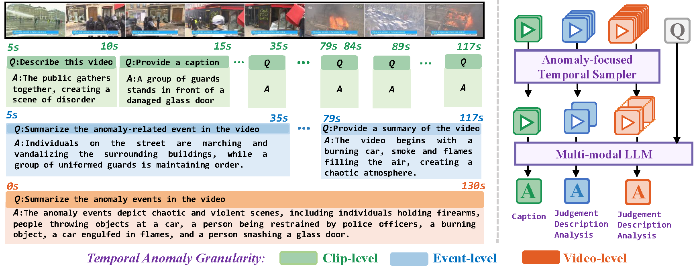
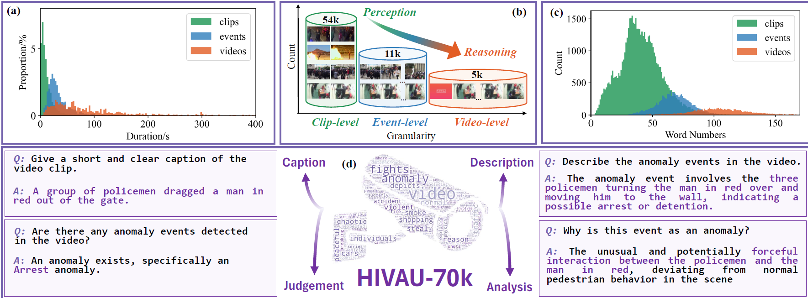
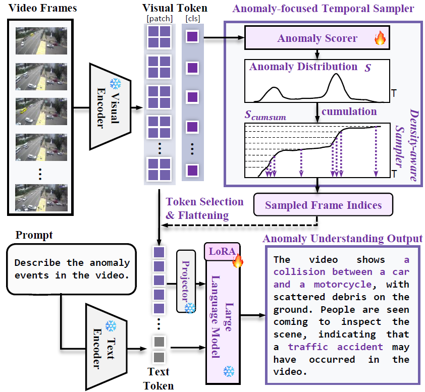

<div align="center">
<h2 align="center"> <a href="https://arxiv.org/abs/2412.06171">
Holmes-VAU: Towards Long-term Video Anomaly Understanding at Any Granularity
</a></h2>

<h5 align="center"> If you like our project, please give us a star ⭐ on GitHub for latest update.  </h2>

</div>

## 📰 News
* **[2025.03.22]** 🔥🔥🔥 Our inference/training code is available, and we release our model at [[HolmesVAU-2B]](https://huggingface.co/ppxin321/HolmesVAU-2B), have a try !
* **[2025.02.27]** 🔥🔥🔥 Holmes-VAU is accpeted by CVPR2025 !
* **[2025.01.05]** 👀 Our dataset **HIVAU-70k** is available now, welcome to **star** ⭐ this repository for the latest updates.

##  :sparkles:Highlights
> **Abstract:** How can we enable models to comprehend video anomalies occurring over varying temporal scales and contexts? Traditional Video Anomaly Understanding (VAU) methods focus on frame-level anomaly prediction, often missing the interpretability of complex and diverse real-world anomalies. Recent multimodal approaches leverage visual and textual data but lack hierarchical annotations that capture both short-term and long-term anomalies.
<section class="hero teaser">
  <div class="container is-max-desktop">
    <div class="hero-body">
      
    </div>
  </div>
</section>

> To address this challenge, we introduce HIVAU-70k, a large-scale benchmark for hierarchical video anomaly understanding across any granularity. We develop a semi-automated annotation engine that efficiently scales high-quality annotations by combining manual video segmentation with recursive free-text annotation using large language models (LLMs). This results in over 70,000 multi-granular annotations organized at clip-level, event-level, and video-level segments.
<section class="hero teaser">
  <div class="container is-max-desktop">
    <div class="hero-body">
      
    </div>
  </div>
</section>

> For efficient anomaly detection in long videos, we propose the Anomaly-focused Temporal Sampler (ATS). ATS integrates an anomaly scorer with a density-aware sampler to adaptively select frames based on anomaly scores, ensuring that the multimodal LLM concentrates on anomaly-rich regions, which significantly enhances both efficiency and accuracy. Extensive experiments demonstrate that our hierarchical instruction data markedly improves anomaly comprehension. The integrated ATS and visual-language model outperform traditional methods in processing long videos.
<div align="center">
<section class="hero teaser">
  <div class="container is-max-desktop">
    <div class="hero-body">
      
    </div>
  </div>
</section>
</div>


## :date: TODO
- [x] Release the paper.
- [x] Release the HIVAU-70k annotations.
- [x] Release the HolmesVAU model.
- [x] Release the inference code.
- [x] Release the training code.

## :speaking_head: Inference
1. Prepare the Enviroment
```bash
conda create -n holmesvau python=3.9
conda activate holmesvau
pip install -r requirements.txt
pip install flash-attn==2.3.6 --no-build-isolation # optional, for training chat models
```

2. Download [HolmesVAU-2B](https://huggingface.co/ppxin321/HolmesVAU-2B)

3. Inference
```bash
# less than 9GB memory on 1 GPU is reuqired
python inference.py
```
We also provide a inference example with visualization in `inference.ipynb`.


## :wrench: Benchmarks
1. Download videos

Download the source videos for UCF-Crime and XD-Violence from the homepage below:
- [UCF-Crime](https://www.crcv.ucf.edu/projects/real-world/)
- [XD-Violence](https://roc-ng.github.io/XD-Violence/)

2. Check the folder

Put all their training videos and test videos in the `[ucf-crime/xd-violence]/videos/[train/test]` folder respectively. Please ensure the data structure is as below.
~~~~
├── HIVAU-70k
    ├── instruction
        ├── merge_instruction_test_final.jsonl
        └── merge_instruction_train_final.jsonl
    ├── raw_annotations
        ├── ucf_database_train.json
        ├── ucf_database_test.json
        ├── xd_database_train.json
        └── xd_database_test.json
    └── videos
        ├── ucf-crime
            ├── clips
            ├── events
            └── videos
                ├── train
                    ├── Abuse001_x264.mp4
                    ├── ...
                └── test
                    ├── Abuse028_x264.mp4
                    ├── ...
        └── xd-violence
            ├── clips
            ├── events
            └── videos
                ├── train
                    ├── A.Beautiful.Mind.2001__#00-01-45_00-02-50_label_A.mp4
                    ├── ...
                └── test
                    ├── A.Beautiful.Mind.2001__#00-25-20_00-29-20_label_A.mp4
                    ├── ...


~~~~

3. Split videos

This process consumes several hours:
```bash
cd HIVAU-70k
python split_video.py
python check_video.py
```

## :dart: Training
1. Download the pre-trained model `InternVL2`

```bash
huggingface-cli download --resume-download --local-dir-use-symlinks False OpenGVLab/InternVL2-2B --local-dir InternVL2-2B
```

2. Fine-tuning

Fine-tune the pre-trained models using the script for training the LoRA adapter, the parameters `GPUS` and `PER_DEVICE_BATCH_SIZE` depends on your available GPU resources. 
```bash
# Using 2 4090-ti GPUs, fine-tune the LoRA, cost about 23G per GPU
cd internvl_chat
CUDA_VISIBLE_DEVICES=0,1 GPUS=2 PER_DEVICE_BATCH_SIZE=2 sh shell/internvl2_2b_finetune_lora.sh
```
```bash
# Using 2 A100 GPUs, fine-tune the LoRA, cost about 30G per GPU
cd internvl_chat
CUDA_VISIBLE_DEVICES=0,1 GPUS=2 PER_DEVICE_BATCH_SIZE=4 sh shell/internvl2_2b_finetune_lora.sh
```

Use the provided script to merge the LoRA weights into the base model. The script takes two arguments: the input path of the fine-tuned model and the output path for the merged model.

```bash
python tools/merge_lora.py <input_path> <output_path>
```
After merging the LoRA weights, you can wrap the fine-tuned model into an AutoModel for easier inference or deployment.
```bash
cp pretrained/InternVL2-2B/*.py <output_path>
```

**Acknowledgement**: We used InternVL as our base model, more details about the training can be found [here](https://internvl.readthedocs.io/en/latest).

## Citation

If you find this repo useful for your research, please consider citing our papers:

```bibtex
@article{zhang2024holmesvau,
  title={Holmes-vau: Towards long-term video anomaly understanding at any granularity},
  author={Zhang, Huaxin and Xu, Xiaohao and Wang, Xiang and Zuo, Jialong and Huang, Xiaonan and Gao, Changxin and Zhang, Shanjun and Yu, Li and Sang, Nong},
  journal={arXiv preprint arXiv:2412.06171},
  year={2024}
}

@article{zhang2024holmesvad,
  title={Holmes-VAD: Towards Unbiased and Explainable Video Anomaly Detection via Multi-modal LLM},
  author={Zhang, Huaxin and Xu, Xiaohao and Wang, Xiang and Zuo, Jialong and Han, Chuchu and Huang, Xiaonan and Gao, Changxin and Wang, Yuehuan and Sang, Nong},
  journal={arXiv preprint arXiv:2406.12235},
  year={2024}
}
```
---

